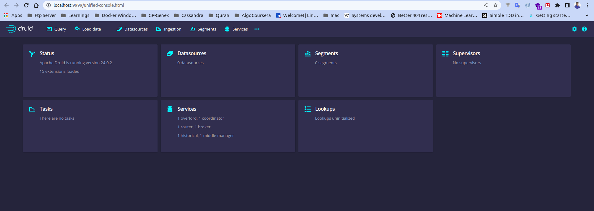

# Configure MinIO, Apache Druid, Superset UI

## Prerequisite
  - Docker v20.7+
  - Docker Compose v2.5+
## What is MinIO?
MinIO offers high-performance, S3 compatible object storage. Native to Kubernetes, MinIO is the only object storage suite available on every public cloud, every Kubernetes distribution, the private cloud and the edge. MinIO is software-defined and is 100% open source under GNU AGPL v3.
[More Info](https://min.io/)
## Install MinIO using Docker

 [MinIO Installation](./minio/README.md)

 ## What is Apache Druid
Apache Druid is a real-time database to power modern analytics applications.
### Overviews
  - Build fast, modern data analytics applications
  - Easy integration with your existing data pipelines
  - Fast, consistent queries at high concurrency
  - Broad applicability
  - Deploy in public, private, and hybrid clouds

[More Info](https://druid.apache.org/)
## Install Apache Druid using Docker

[Apache Druid Installation](./apache_druid/README.md)