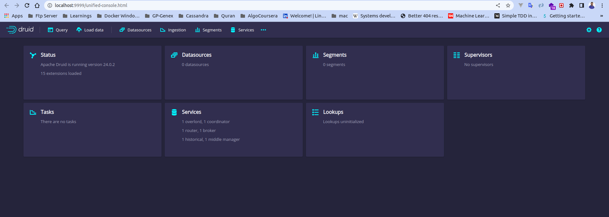

# Apache Druid Installation

## To Do
  1. Open terminal in `apache_druid` directory
  2. Create environment files from the example
      ```
        cp .env.example .env
        cp environment.example environment
      ```
  3. Change the envirenment variables as per requirement
  4. Define the exposed ports in `.env`
      ```
        # Expose Ports
        DRUID_POSTGRES_PORT=5432
        DRUID_ZOOKEEPER_PORT=2181
        DRUID_COORDINATOR_PORT=8081
        DRUID_BROKER_PORT=8082
        DRUID_HISTORICAL_PORT=8083
        DRUID_MIDDLEMANAGER_PORT=8091
        DRUID_ROUTER_PORT=9999
      ```
  5. Define Postgres Configurations in `.env`
      ```
        # Postgres Config
        POSTGRES_PASSWORD=FoolishPassword
        POSTGRES_USER=druid
        POSTGRES_DB=druid
      ```
  6. For Basic Authentication update the following in `environment`
      ```
        # Authentication
        druid_auth_authenticatorChain=["MyBasicMetadataAuthenticator"]
        druid_auth_authenticator_MyBasicMetadataAuthenticator_type=basic
        druid_auth_authenticator_MyBasicMetadataAuthenticator_initialAdminPassword=password
        druid_auth_authenticator_MyBasicMetadataAuthenticator_initialInternalClientPassword=password
        druid_auth_authenticator_MyBasicMetadataAuthenticator_credentialsValidator_type=metadata
        druid_auth_authenticator_MyBasicMetadataAuthenticator_skipOnFailure=false
        druid_auth_authenticator_MyBasicMetadataAuthenticator_authorizerName=MyBasicMetadataAuthorizer
        
        # Escalator
        druid_escalator_type=basic
        druid_escalator_internalClientUsername=druid_system
        druid_escalator_internalClientPassword=password
        druid_escalator_authorizerName=MyBasicMetadataAuthorizer
        
        # Authorizer
        druid_auth_authorizers=["MyBasicMetadataAuthorizer"]
        druid_auth_authorizer_MyBasicMetadataAuthorizer_type=basic
      ```
  7. To connect MinIO as druid s3 storage update the following in `environment`
      ```
        # Deep Storage Configuration
        druid_storage_type=s3
        druid_storage_bucket=<Write Bucket Name>
        druid_storage_baseKey=<Write bucket\'s base directory e.g. druid/segments>
        druid_s3_accessKey=<Write access key e.g. access-key>
        druid_s3_secretKey=<Write secret key e.g. secret-key>
        druid_s3_protocol=http
        druid_s3_enabePathStyleAccess=true
        druid_s3_endpoint_signingRegion=us-east-1
        druid_s3_endpoint_url=<Write S3 Url e.g. http://10.10.1.23:4094>
      ```
  8. To keep the logs in s3 storage use following in `environment`
      ```
        druid_indexer_logs_type=s3
        druid_indexer_logs_s3Bucket=<Write Bucket Name e.g. cpbucket>
        druid_indexer_logs_s3Prefix=<Write bucket\'s directory prefix e.g. druid/indexing-logs>
      ```
  9. Run on terminal
      ```
        docker compose up -d
      ```
  10. Application will be running in port defined by `DRUID_ROUTER_PORT` `http://localhost:9999/`
  11. Login with the user credentials defined in configuration
      ```
        username=admin
        password=password
      ```
## Screenshot

### Learn More
  - [Apache Druid with Docker](https://druid.apache.org/docs/latest/tutorials/docker.html)