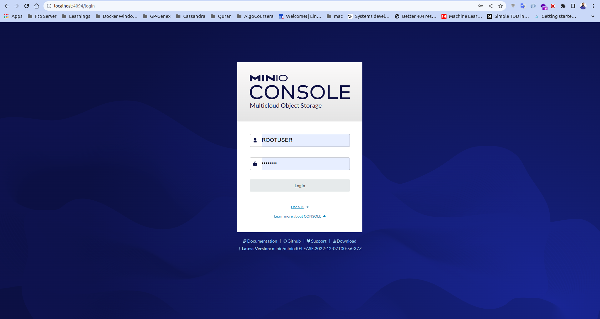

# Installation MinIo

## To Do
  1. Open terminal in `minio` directory
  2. run `cp .env.example .env`
  3. Setup the environment variables
  4. run `docker compose up -d`
  3. MinIO server will be running in `http://localhost:4094/`

## MinIO GUI Screenshot
