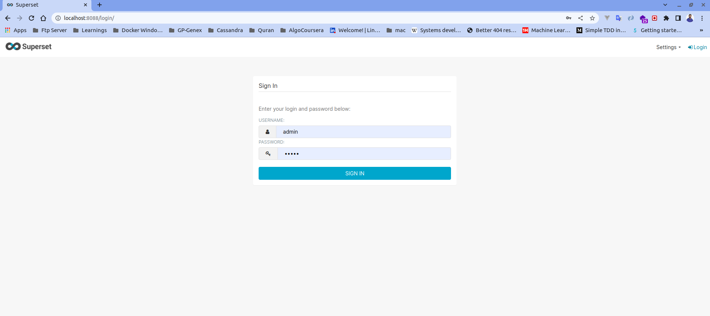

# Install Superset UI

## To Do
  1. Clone Superset's repo in your terminal with the following command:
      ```
      git clone https://github.com/apache/superset.git
      ```
  2. Launch Superset Through Docker Compose
  3. Open terminal in superset directory
      ```
        cd superset
      ```
  4. Run docker compose command
      ```
        docker compose -f docker-compose-non-dev.yml pull
        docker compose -f docker-compose-non-dev.yml up -d
      ```
  5. Login to Superset UI using `http://localhost:8088`
      ```
        username: admin
        password: admin
      ```
## Official Installation Guideline
[Installation Precedure](https://superset.apache.org/docs/installation/installing-superset-using-docker-compose)

## Superset UI Screenshot
